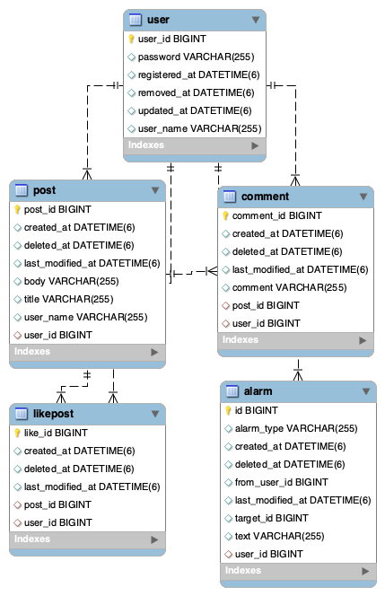
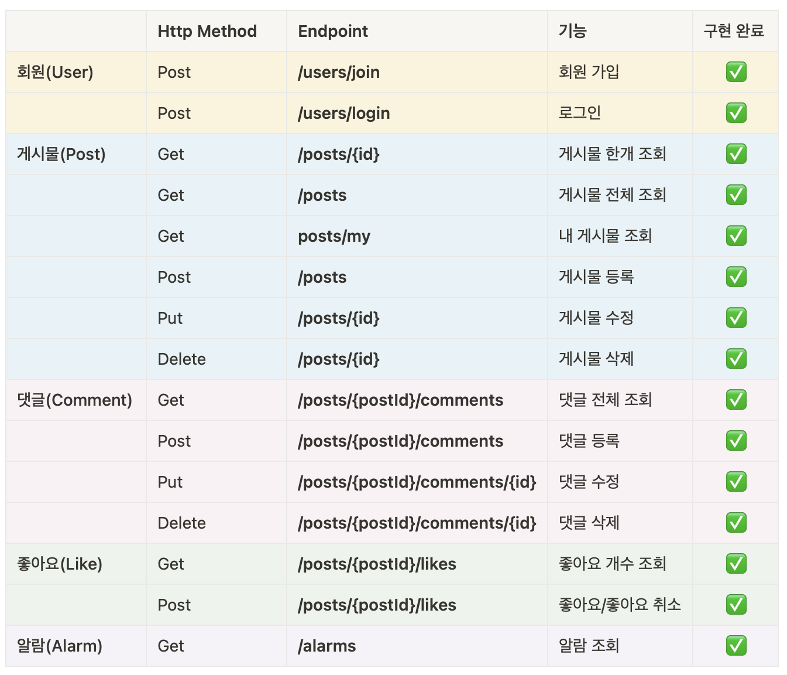

# 🦁 Final Project [ Mutsa SNS ]

## 📍프로젝트 개요 
- Spring Boot Jpa 를 이용하여 SNS 서비스 구현하기 

## 🗓 개발 기간 
- 22/12/20 ~
## ⚒️ Tech stacks

	
    
    
    
     
    
    
     
    
    
    
    

## 🔍 Swagger
http://ec2-3-34-4-22.ap-northeast-2.compute.amazonaws.com:8080/swagger-ui/

## 🏗 Architecture

## ⛓ Erd

## ⚙️ Endpoints (/api/v1)

## 🔍 중간 회고
- `CI/CD`는 직접 사용해보니 예상했던 것보다 훨씬 더 편리했다. 이전에 도커에 직접 배포하고 오류를 해결하던 때를 생각하면 
확실히 개발 이외에 다른 일을 줄여주어 기능 구현에 더 시간을 사용할 수 있었다. 
- User~Post 기능 구현 때 예상보다 시간이 촉박했기 때문에, 그 이후에는 기능을 우선으로 구현하고 후에 리팩토링을 하는 방식으로 진행해보았다.
하지만 리팩토링에 시간이 너무 많이 들어서 이것도 그렇게 좋은 방법은 아니었던 것 같다. 그렇지만 설계를 꼼꼼히 해도 결국 구현 중에 문제는 생기기 때문에
적당한 설계의 기준을 세우는 것이 중요한 것 같다. 계속해서 프로젝트를 진행하다보면 어느정도 설계의 기준도 생기고 코딩 패턴도 생겨서 효율이 올라갈 것이라고 생각한다.
- 새로운 기능을 구현할 때마다 당연히 여기고 `controller`, `service`를 나누어서 코드를 작성했는데 like와 alarm 기능을 구현하면서 
꼭 모두 나누어 줘야 하는지 의문이 생겼다. 
- 비슷한 맥락으로 `dto`를 나누는 기준에 대해서도 로직을 짜면서 끊임없이 고민했는데(필드가 같은데 꼭 나누어줘야 할지) 이 부분에 대해서 우선은 추후에 확장성을 위해 
최대한 나누어서 설계하는게 좋다는 결론을 내렸다. 
- 처음 구현을 할 때 post 수정, comment 수정 과 같이 특정 필드의 값만 update를 해줘야하는 경우 entity에 setter를 붙여서 set으로 값을 넣어줬는데 
`entity에는 setter사용을 지양`하라는 내용을 보게 되었고(자세한 내용은 블로그에 정리) entity에 함수를 만들어주는 식으로 리팩토링 해주었다.
- `soft delete`는 굉장히 편리한 jpa의 기능이었지만 timezone이 asia에 맞춰져있지 않아 db쪽에서 timezone 설정을 해줘야했다. 
- 등록,수정,삭제 시간을 `auditing`을 적용해 리팩토링 했는데 시간 저장해주는 코드가 필요 없어져서 로직이 간결해지고 너무 편리했다.

➡️아직 `spring security`부분의 이해가 특히 많이 부족하다. 공부를 더 하고 ui 구현과 함께 user role 기능도 구현할 예정이다. 

