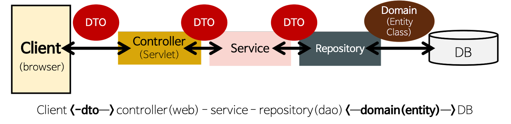
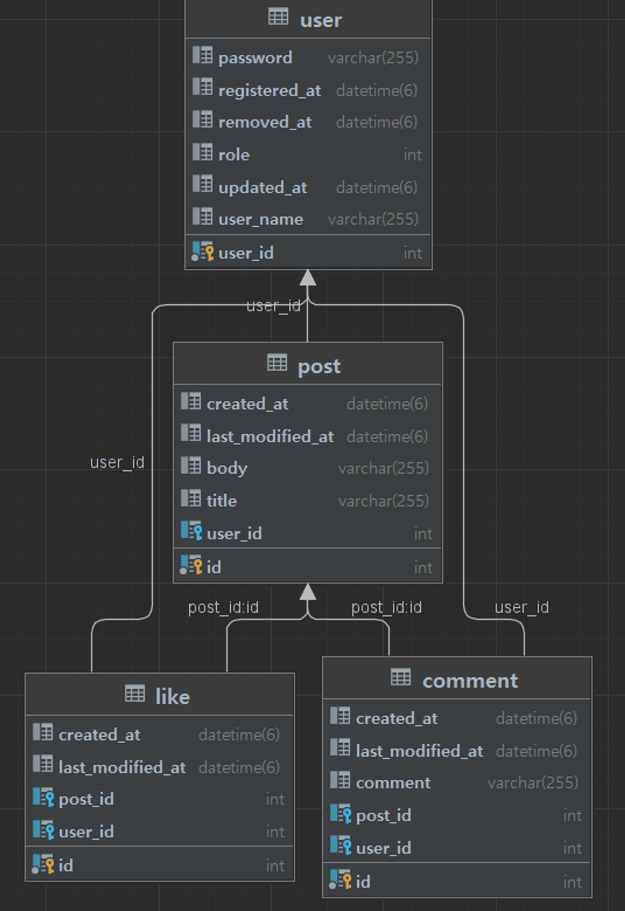

# 🦁 Final Project [ Mutsa SNS ]

## ⚒️ Tech stacks 
`Java`  `SpringBoot`  `SpringSecurity`  `MySql`  `AmazonEC2`  `Docker`  `GitLab`

## 🔍 Swagger
http://ec2-3-34-195-196.ap-northeast-2.compute.amazonaws.com:8080/swagger-ui/

## 🏗 Architecture


## ⛓ Erd



## ⚙️ Endpoints 
### http://ec2-3-34-195-196.ap-northeast-2.compute.amazonaws.com:8080/
### 회원 인증/인가 (api/v1/users)
- 회원가입 (/join)

Request Body
```json
{
	"userName" : "user1",
	"password" : "user1234"
}
```
Response Body
```json
{
    "resultCode": "SUCCESS",
    "result": {
        "userId": 5,
        "userName": "test1"
    }
}
```
- 로그인 (/login)

Request Body
```json
{
  "userName" : "user1",
  "password" : "user1234"
}
```
Response Body
```json
{
  "resultCode": "SUCCESS",
  "result": {
    "jwt": "eyJhbGciOiJIU"
  }
}
```

### 포스트 (api/v1/posts)
- `GET` 전체 조회 

Request Body
```json
"resultCode": "SUCCESS",
"result": {
"content": [
{
"id": 10,
"title": "title",
"body": "body",
"userName": "name",
"createdAt": "2022/12/26 10:43:25",
"lastModifiedAt": "2022/12/27 10:43:25"
}
...
```

- `POST` 포스트 등록

Request Body
```json
{
  "title" : "title1",
  "body" : "body1"
}
```
Response Body
```json
{
  "resultCode":"SUCCESS",
  "result":{
    "message":"포스트 등록 완료",
    "postId":0
  }
}
```
- `GET` 포스트 상세(/{postsId})

Response Body
```
{
	"resultCode":"SUCCESS",
	"result":{
		"id" : 1,
		"title" : "title",
		"body" : "body",
		"userName" : "user",
		"createdAt" : yyyy-mm-dd hh:mm:ss,
		"lastModifiedAt" : yyyy-mm-dd hh:mm:ss
	}
}

```
- `PUT` 포스트 수정(/{id})

Request Body
```json
{
  "title" : "modified title",
  "body" : "modified body"
}
```
Response Body
```json
{
  "resultCode":"SUCCESS",
  "result":{
    "message":"포스트 수정 완료",
    "postId":0
  }
}
```
- `DELETE` 포스트 삭제(/{id})

Response Body
```json
{
  "resultCode":"SUCCESS",
  "result":{
    "message":"포스트 삭제 완료",
    "postId":0
  }
}
```


